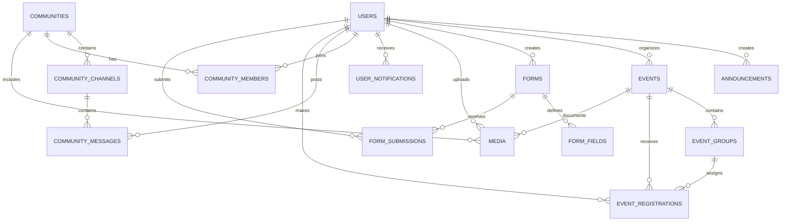

<div align="center">

# 🌈 CampusHub

### The colorful digital home for campus life

<table>
  <tr>
    <td bgcolor="#ef4444" width="110">&nbsp;</td>
    <td bgcolor="#f97316" width="110">&nbsp;</td>
    <td bgcolor="#eab308" width="110">&nbsp;</td>
    <td bgcolor="#22c55e" width="110">&nbsp;</td>
    <td bgcolor="#06b6d4" width="110">&nbsp;</td>
    <td bgcolor="#3b82f6" width="110">&nbsp;</td>
    <td bgcolor="#8b5cf6" width="110">&nbsp;</td>
  </tr>
</table>

A PHP and MySQL campus community platform for discovering events, joining communities, sharing media, and staying connected.

[Student Portal](student.php) · [Admin Portal](admin.php) · [Home Page](index.php)

</div>

## ✨ What Is CampusHub?

CampusHub brings everyday university activities into one welcoming portal. Students can explore campus life and manage their participation, while administrators can maintain the platform's content and records.

## 🎨 Features

| Area | Highlights |
| --- | --- |
| **Student portal** | Dashboard, profile, notifications, event search, registrations, communities, announcements, forms, and media gallery |
| **Events** | Browse upcoming activities, view event details, register, and export event data |
| **Communities** | Discover and join clubs, departments, and student organizations |
| **Announcements** | Read timely updates from campus administration |
| **Media** | Browse campus images and videos; administrators can upload new media |
| **Forms** | View forms published by administrators |
| **Admin portal** | Dashboard statistics, student records, event management, content management, organizations, and media uploads |
| **Authentication** | Student registration and sign-in plus protected administrator access |

## 🧰 Built With

- **PHP** for server-rendered pages and API endpoints
- **MySQL** with **MySQLi** for persistence
- **Bootstrap 5.3** for responsive layout and components
- **Bootstrap Icons** for interface icons
- **HTML, CSS, and JavaScript** for the interactive portal experience

## 📁 Project Structure

```text
CampusHub/
├── .env.example              # Environment variable template
├── index.php                 # Public landing page
├── student.php               # Student portal
├── admin.php                 # Administrator portal
├── database/
│   └── database.sql          # Database schema and seed data
├── api/                      # JSON/API handlers
│   ├── announcements.php
│   ├── auth.php
│   ├── communities.php
│   ├── events.php
│   ├── export_events.php
│   ├── forms.php
│   ├── media.php
│   └── students.php
├── config/
│   └── db.php                # MySQL connection and session setup
├── script/
│   ├── admin.js
│   └── student.js
├── style/
│   ├── admin.css
│   ├── custom.css
│   └── student.css
└── uploads/                  # Uploaded media files
```

## 🗄️ Database Design

The database is defined in [database/database.sql](database/database.sql) and uses MySQL with InnoDB foreign-key relationships.



### Main Tables

| Table | Purpose | Important relationships |
| --- | --- | --- |
| `users` | Stores student and administrator accounts, profiles, roles, and status | Parent table for authored content, memberships, messages, registrations, submissions, and notifications |
| `events` | Stores campus event details, schedules, locations, capacities, and status | Belongs to an organizing user; has groups, registrations, and media |
| `event_groups` | Defines optional groups within an event | Belongs to an event and can contain registrations |
| `event_registrations` | Tracks student event registration, attendance, and selected group | Links `users`, `events`, and `event_groups` |
| `communities` | Stores clubs, departments, and organizations | Has channels, members, and media |
| `community_members` | Maps users to communities with member, moderator, or admin roles | Many-to-many relationship between `users` and `communities` |
| `community_channels` | Stores text, media, and announcement channels | Belongs to a community and contains messages |
| `community_messages` | Stores messages and optional media attachments | Belongs to a channel and authoring user |
| `announcements` | Stores campus updates with category, priority, audience, and status | Optionally created by a user |
| `forms` | Stores administrator-created forms and their status | Has fields and submissions |
| `form_fields` | Defines the fields, options, order, and required state for a form | Belongs to a form |
| `form_submissions` | Stores submitted form responses as JSON | Links a form to the submitting user |
| `media` | Stores uploaded file metadata and optional descriptions | Can link uploads to a user, community, or event |
| `user_notifications` | Stores user-specific notifications and read status | Belongs to a user |

### Relationship Rules

- Deleting a community removes its channels, members, and messages through cascading relationships.
- Deleting an event removes its groups and registrations; related media is detached rather than deleted.
- Deleting a user removes memberships, registrations, submissions, and notifications, while authored announcements, events, forms, and media keep their records with a null author.
- A unique constraint prevents the same user from joining the same community more than once.

## 🚀 Run Locally

### Requirements

- PHP 7.4+ with the `mysqli` extension
- MySQL or MariaDB
- Apache, XAMPP, WAMP, or PHP's built-in development server
- An internet connection for Bootstrap and Bootstrap Icons CDN assets

### Setup

1. Clone or copy this project into your local web server directory.
2. Create a MySQL database named `campushub`.
3. Import the database schema and seed data from `database/database.sql`:

  ```bash
  mysql -u root -p < database/database.sql
  ```

4. Copy `.env.example` to `.env` and set the database host, username, password, and database name for your machine:

  ```bash
  copy .env.example .env
  ```

5. Ensure the `uploads/` directory is writable by the web server.
6. Start the application from the project directory:

   ```bash
   php -S localhost:8000
   ```

7. Open [http://localhost:8000](http://localhost:8000) in your browser.

For Apache or XAMPP, place the project under the server's document root and open the matching local URL instead.

## 🧭 Using the Portals

### Students

1. Open the **Student Portal**.
2. Register a new account or sign in.
3. Use the navigation tabs to explore events, communities, announcements, media, and forms.
4. Update your profile and manage event registrations from the portal.

### Administrators

1. Open the **Admin Portal**.
2. Sign in with administrator credentials.
3. Use the sidebar to manage students, events, media, announcements, forms, and communities.
4. Review dashboard statistics to monitor campus activity.

## 🔐 Security Notes

- Do not commit `.env`, real database passwords, or production credentials.
- Use `.env.example` as the shareable configuration template.
- Configure deployment secrets through environment-specific secret management.
- Validate uploads and restrict file permissions in the `uploads/` directory.

## 🌟 Project Vision

CampusHub is designed to make campus information easier to discover, communities easier to join, and student participation more visible. One platform, many ways to belong.

<div align="center">

**Made for a more connected campus** 🌈

</div>
